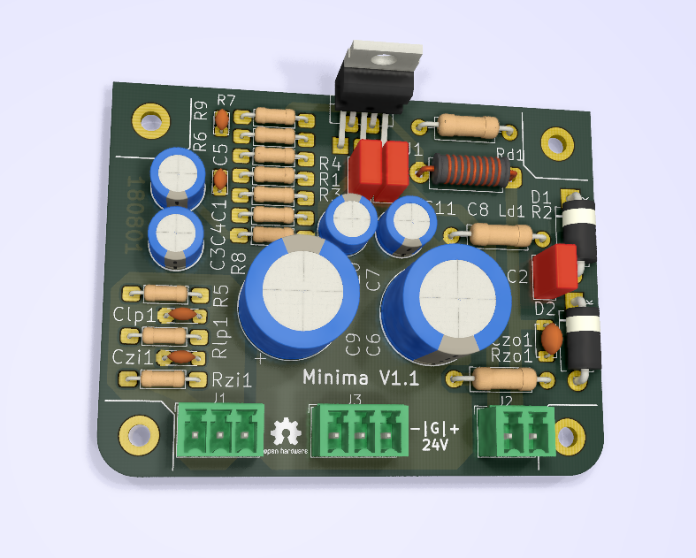

.. contents:: Table of Contents
   :depth: 3


Introduction
============

This document shall describe rationales used to design and build audio 
power amplifier using LM1875 integrated circuit.

Architecture
============

The amplifier architecture consists of the following sections:

* Input circuit
* Power amplifier
* Power supply

All sections are located on separate PCB boards.

.. image:: images/pcb_from_top.png




Input circuit 
==================================

The input circuit contains:

* Input EMI suppression

Input EMI suppression
---------------------

To protect the input from EMI we will use the following Zobel network:

.. code::
          o Positive input or negative input
          |
          |
        ----- Czi
        -----
          |
          |
         +-+  Rzi
         | |
         | |
         +-+
          |
         === Ground


For most input cables characteristic impedance falls in range between
50 and 100ohm impedance and we are using the 75ohm as the middle value. The
resistor Rzi is ``Rzi=75ohm`` and the capacitor Czi is ``Czi=220pF``.
This network should be placed right at the input connector, not on the
main amplifier PCB.


Also, a 100n X7R capacitor shall be placed between SGND and chassis right at the
input connector. This capacitor will shunt radio and other interfirence signal
into the Chassis Ground potential.

Power amplifier
===============

* Input low pass filter
* The ground loop breaker resistor
* Output EMI suppression

Input low pass filter
---------------------

For input filter we choose the frequency between 300kHz and 400kHz.

.. code::

        +---+ Rlp1    +---+ Rlp2
    0---+   +----+----+   +---+---o Toward Amplifier IC block
        +---+    |    +---+   |
               ----- Clp1   ----- Clp2
               -----        -----
                 |            |
                === Ground   === Ground


Using the 2nd order CR low-pass filter calculator at URL:
*http://sim.okawa-denshi.jp/en/CRCRtool.php* we arrive at:

.. math::

    Rlp1 = 100 Ohm, Rlp2 = 100 Ohm

    Clp1 = 220pF,   Clp2 = 2.2nF

    fp1 = 352kHz

    fp2 = 14MHz
	

For more details please refer to: http://www.johnhearfield.com/RC/RC4.htm

The ground loop breaker resistor
--------------------------------

A ground loop breaker resistor is located between SGND and GNDPWR grounds. The
value of this resistor should be around 10 ohms.

Output EMI suppression
----------------------

Output network consists of upstream and downstream Zobel Network and of output
coil (``Ld``) with parallel, damping resistor (``Rd``). Upstream Zobel network 
provides a low-inductance load for the output stage at very high frequencies 
and allows high-frequency currents to circulate local to the output stage. The 
downstream Zobel network provides a good resistive termination right at the 
speaker terminals at high frequencies, helping to reduce RFI ingress and damp
resonances with, or reflections from, the speaker cables.
The output circuit is the following:

.. code::

    Ld
             xxx
        +---x   x   x---+
        |        xxx    |
        |               |
        |   +-------+   |
    o---+---|       |---+---o
    Vout    +-------+   |   Vspeaker
        Rd              |
                      ----- Cz2 = 100nF
                      -----
                        |
                        |
                       +-+  Rz1 = 10 Ohm
                       | |
                       | |
                       +-+
                        |
                       ===


The output coil ``Ld`` provides high frequency isolation of output load from 
output stage of LM1875. The inductance value should be between 2uH up to 5uH. 
Output shunt resistor should be between 2 Ohm and 5 Ohms. See 
*Douglas Self - Audio Power Amplifier Design Handbook, 3rd Ed., Output networks, 
chapter 7* for effect on power amplifier transfer function.

Power dissipation
`````````````````

**NOTE:**

* Maximum power dissipation should be around 25W per IC package for LM1875.

Fortunately, with music signals the power dissipation should be lower. 
Effective power of music signal is about 2 to 10 times as smaller than 
effective power of sinusoid signal. The power transformer is 200VA, meaning 
that each channel gets 100VA of power. Since the maximum output power at 8ohms 
is approximately 50W we get that the transformer supports crest factor of 4 
(see: 
*https://www.neurochrome.com/taming-the-lm3886-chip-amplifier/power-supply-design*).

Gain value
----------

For this power amplifier we are using non-inverting topology for simplicity
reasons. If you would like to have less distortion then LM1875 should be used
in inverting configuration.

The equivalent gain circuit resistance needs to stay below 600ohms. This is so
because all noise measurements in data-sheet were done with 600ohms or 0ohms.

Using low feedback gain is preferred for several reasons:

* there is more loop gain available to reduce the distortion
* reduced output noise
* lower offset at output

Nominal gain is:

.. math::

    G=-Rf/Rg+1


Using E24 series of resistors:

+-----------+-----------+---------+
| Rf [Ohm]  | Rg [kOhm] | G [V/V] |
+-----------+-----------+---------+
| 510       |  7.5      | 15.7    |
+-----------+-----------+---------+
| *510*     |  *8.2*    | *17.0*  |
+-----------+-----------+---------+
| 510       |  9.1      | 18.8    |
+-----------+-----------+---------+
| 510       | 10.0      | 20.6    |
+-----------+-----------+---------+
| 510       | 11.0      | 22.5    |
+-----------+-----------+---------+

Using E48 series of resistors:

+-----------+-----------+---------+
| Rf [Ohm]  | Rg [kOhm] | G [V/V] |
+-----------+-----------+---------+
| 511       |  7.50     | 15.7    |
+-----------+-----------+---------+
| 511       |  7.87     | 16.4    |
+-----------+-----------+---------+
| *511*     |  *8.25*   | *17.1*  |
+-----------+-----------+---------+
| 511       |  8.66     | 17.9    |
+-----------+-----------+---------+
| 511       |  9.09     | 18.8    |
+-----------+-----------+---------+
| 511       |  9.53     | 19.6    |
+-----------+-----------+---------+
| 511       | 10.00     | 20.6    |
+-----------+-----------+---------+
| 511       | 10.50     | 21.5    |
+-----------+-----------+---------+
| 511       | 11.00     | 22.5    |
+-----------+-----------+---------+
| 499       |  7.50     | 16.0    |
+-----------+-----------+---------+

Chosen values for E24 series:

* Rf = 7.5kOhm
* Rg = 510 Ohm
    
Chosen values for E48 series:

* Rf = 7.5kOhm
* Rg = 499 Ohm
 
Frequency compensation
----------------------

The LM1875 is modeled in the following way:

* ``Aol``, typical open loop gain at DC.
* ``Fp1``, dominant pole.
* ``Fp2``, a pole which probably originates from output stage.
* ``Fp3``, pole which probably originates from input or intermediate stages.
* ``Fp4 Hz``, pole which probably originates from input or intermediate stages.
* ``Rops``, open loop output stage impedance. The OPS open loop impedance is 
  unusually low because the LM1875 uses output inclusive Miller compensation
  which can be observed on the equivalent schematic in the data-sheet.

+-----------+-----------+-----------+-----------+-----------+-----------+-----------+
| Chip      | Aol [dB]  | Fp1 [Hz]  | Fp2 [Hz]  | Fp3 [Hz]  | Fp4 [Hz]  | Rops [Ohm]|
+-----------+-----------+-----------+-----------+-----------+-----------+-----------+
| LM1875    | 90        | 15        | 1.5e6     | 8e6       | 9e6       | 500e-3    |
+-----------+-----------+-----------+-----------+-----------+-----------+-----------+

Lead compensation
`````````````````

Equivalent feedback network with lead compensation circuit::

          + Vout
          |
          *------+
          |      |
         +-+ Rf  |
         | |   ----- Cf=Cl (+Csi, see Input pin capacitance compensation)
         | |   -----
         +-+     |
   Vf     |      |
    +-----*------+
          |
         +-+ Rg
         | |
         | |
         +-+
          |
          + Input

Resistors `Rf` and `Rg` are part of feedback network. Capacitor `Cf` is the
compensation capacitor. The transfer function of this network is given as:

.. math::

    Vf(s)=I(s)*Rg

    Vout(s)=I(s)*(Rf||Cl + Rg)=I(s)*(Rf/(1+s*Rf*Cl)+Rg)

    H(s)=Vf(s)/Vout(s)=(Rg/(Rf+Rg))*((1+s*Rf*Cl)/(1+s*Re*Cl))

Zero: 

.. math::

    wz=1/(Rf*Cl)

Pole: 

.. math::

    wp=1/(Re*Cl)

Where:

.. math::

    Re=Rf||Rg=Rf*Rg/(Rf+Rg)

With this compensation we want to compensate for LM3886 ``fp2`` pole. Although
the ``fp2`` pole has a high value of it still has quite the effect on the gain 
phase near unity gain bandwidth (UGBW) value. To compensate for ``fp2``
pole we can use ``wz`` equation above. 

For LM1875 we would get:

.. math::
    
    Rf = 7.5kOhm
    
    fp2 = 1.5e6 Hz
    
    Cl=1/(2*pi*Rf*fp2)=14.1pF
    
Outcome:

* By using this compensation we improve the loop gain phase around UGBW point
  and at higher frequencies.
* The ``Cf`` in this compensation is known to reduce the closed loop
  bandwidth. Since the ``Cf`` value is so small the impact to closed loop
  bandwidth should be minimal.

Input pin capacitance compensation
``````````````````````````````````

Input pins have the following parasitic capacitances associated:

* Cdiff
* Cm
* Cstray

The LM1875 data-sheet does not specify any parameter regarding parasitic
input capacitances. Voltage feedback OPAMPS usually have both differential and
common-mode input impedances specified. In the absence of any information, it
is safe to use the model given in the next figure:

.. code::

                   +----+ Zdiff
    +input o---+---|    |---+---o -input
               |   +----+   |
               |            |
              +-+ Zcm1     +-+ Zcm2
              | |          | |
              | |          | |
              +-+          +-+
               |            |
              ===          ===

We can use a rough estimation of values based on experience on using other 
audio BJT OPAMPS, and typical values are around ``Cdiff=5pF``, ``Cm=4pF`` 
and ``Cstray=3pF``. All three equivalent capacitors are tied in parallel, 
so the total input capacitance becomes:

.. math::

    Cinput = Cdiff+Cm+Cstray=5pF+5pF+3pF=12pF
    
To mitigate this capacitance we can add capacitance `Csi` parallel to `Rf` 
resistor. To compensate for this the following equation is applied:

.. math::

    Rf*Csi=Rg*Cinput
    
    Csi=Cinput*Rg/Rf=0.8pF
    
Since we are already using lead compensation we just add this value to existing
`Cl` capacitor.

Also, note that LM1875 model has tree more additional poles:

* ``Fp2``, pole which probably originates from input or intermediate 
  stages.
* ``Fp3``, pole which probably originates from input or intermediate 
  stages.
* A pole from ``Rops``, open loop output stage impedance which in conjunction 
  with output Zobel and connected load forms another high frequency pole.
   
Although all above poles are very high in frequency they still have their
impact on lower frequency part of transfer function and reduce a few degrees of
phase margin at UGBW point (approx. at 500kHz). Because of these poles we can
freely put a bit bigger `Cf` capacitor value in the feedback network. Rough
estimation is to put additional 1-3pF.

.. math::

	Cadd = 2pF

For LM1875 we get:

.. math::

    Cf=Cl+Csi+Cadd=14.1+0.8+2pF=16.9pF
    
Since the closest, standard values of capacitors are 15pF and 18pF, we choose
the 15pF as the final value for `Cl` capacitor:

.. math::

    Cf=15pF 

Power supply
============

Before rectifier diodes a snubber RC circuit should be placed to decrease diode
switching impulse. Recommended values are ``Rsn = 1 Ohm``, ``Csn = 470nF``::

          o Vsupply
          |
          |
        ----- Csn = 470nF
        -----
          |
          |
         +-+  Rsn = 1 Ohm
         | |
         | |
         +-+
          |
         === Ground

This snubber may be placed near the IC power supply lines, too.

Using stabilized power supplies, for example by using LT1083 regulator is only
meaningful at lower output powers. The regulation becomes really expensive when
used in high power amplifiers. Regulated power supplies are OK when used up to
powers of 20W-30W @ 8 Ohm.

**NOTE:**

* On case chassis there should be a safety ground screw just near at the input
  220V socket.

Transformer specification for LM1875 amplifier is the following:

* ``S=80VA``, power rating.
* ``Usn1=18Veff``, first secondary nominal voltage.
* ``Usn2=18Veff``, second secondary nominal voltage.
* ``k=10%``, regulation.

Secondary internal resistance is:

.. math::

    Usu=Usn1*(1+(k/100))
    
    Isn=S/(Usn1+Usn2)
    
    Ri=(Usn1-Usu)/Isn
    
Using values from above we get:

.. math:: 
    
    Usu=18*(1+(10/100))=19.8Veff
    
    Isn=2.2Aeff

    Ri=810mOhm
    
The power supply section is using single banks of 10mF capacitors with 0.22Ohm
resistor in series between bridge rectifier and smoothing capacitors.


